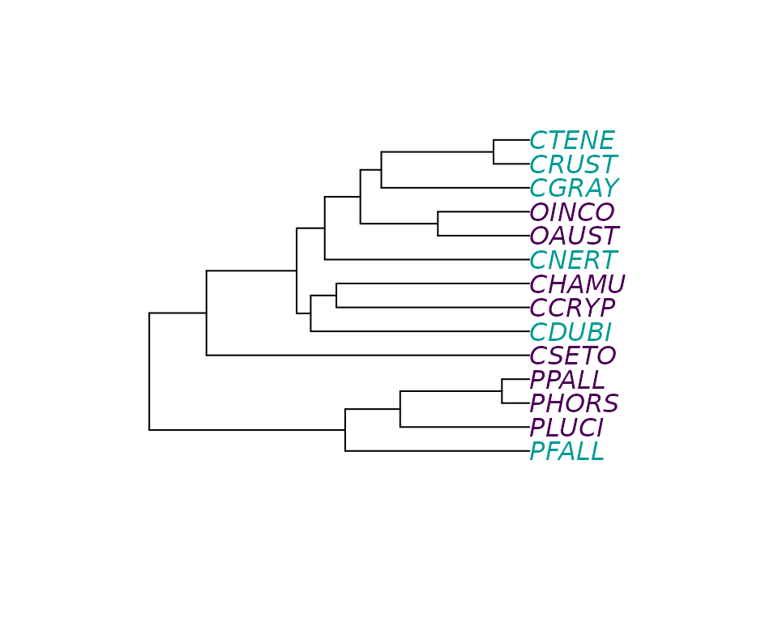
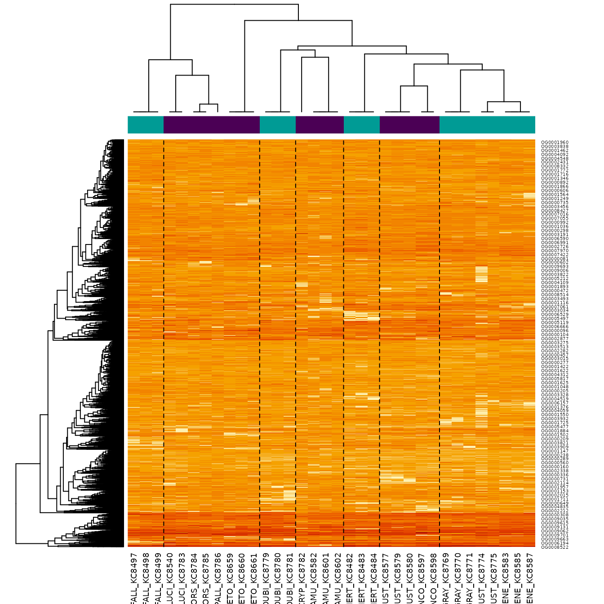
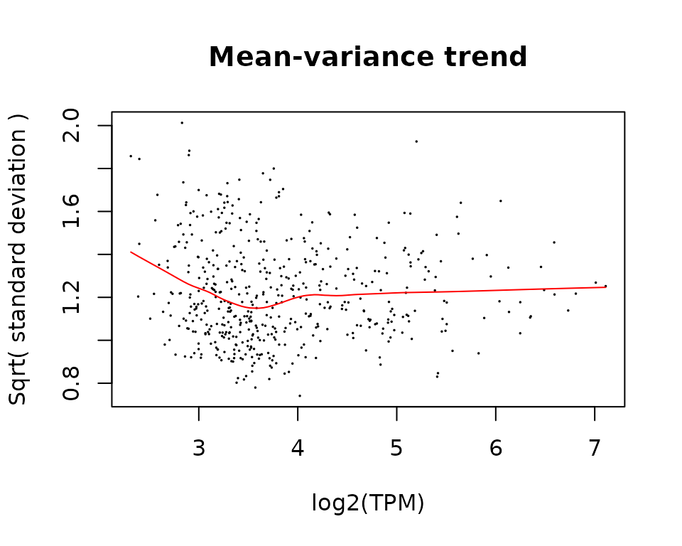
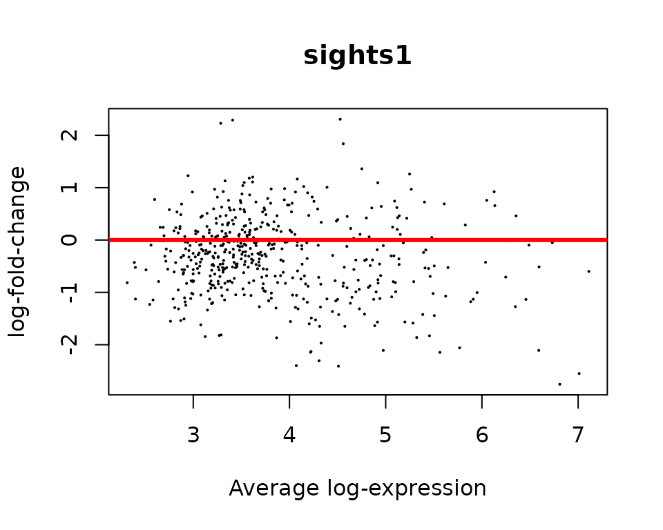
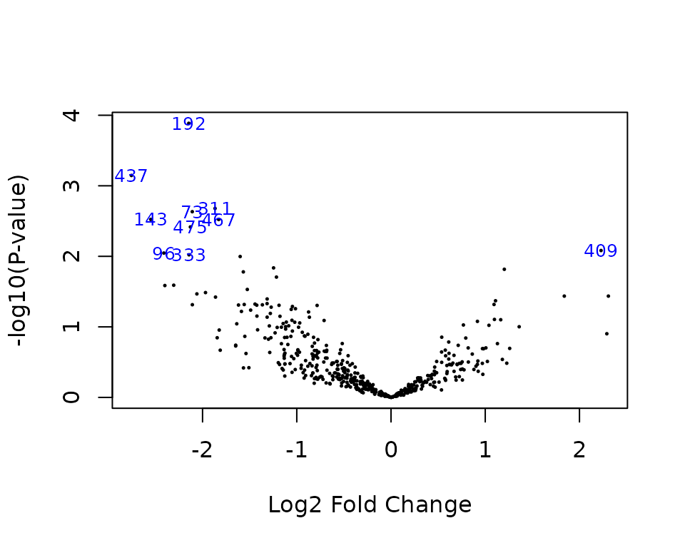
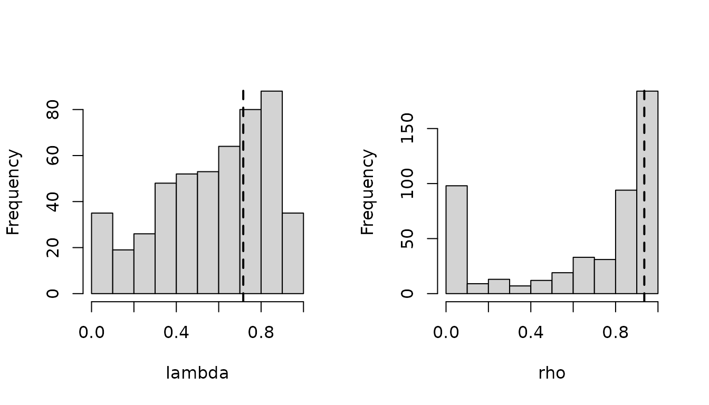

# Crayfish Exemple Tutorial

``` r

library(limma)
library(phyloDE)
```

## Data

In this tutorial, we re-analyse the Crayfish dataset from Stern &
Crandal (2018)[^1], re-analysed in Bastide et al. (2023)[^2], and
available in the `crayfish` dataset.

``` r

data(crayfish)
```

The dataset contains a count RNA-Seq matrix, associated gene lengths, a
phylogenetic tree of the crayfish species included in the study, and a
data-frame specifying whether a species is blind (0) or sighted (1). The
goal of this script is to detect genes with a significant parallel shift
in optimum between blind species versus sighted species (one of the
hypothesis presented in the Table from Stern & Crandal (2018)[^3] ).

``` r

library(ape)
cond_species <- crayfish$sights$sights[match(crayfish$tree$tip.label, crayfish$sights$species)]
plot(crayfish$tree, tip.color = hcl.colors(3)[as.numeric(cond_species)])
```



## Normalization of the data

In order to apply `phyloDE`, we need to normalize the data. Here, we use
TPM, with normalizing factors computed using the TMM method.

``` r

nf <- edgeR::calcNormFactors(crayfish$counts / crayfish$lengths, method = "TMM")
#> calcNormFactors has been renamed to normLibSizes
norm_data <- lengthNormalizeRNASeq(crayfish$counts, 
                                   crayfish$lengths, 
                                   nf, 
                                   lengthNormalization = "TPM", 
                                   dataTransformation = "log2")
```

## Design matrix

We then construct the design matrix, to analyse the effect of sight on
gene expression.

``` r

design <- model.matrix(~ sights, model.frame(crayfish$sights))
```

## Heatmap matrix

We can plot the data with a heatmap, using the phylogenetic structure on
the columns, and a standard clustering on the rows.

``` r

phyHeatmap(norm_data, design, coef = 2, crayfish$tree, margins = c(7, 3))
```



## Fit with `phyloDE`

Finally, we apply `phylolmFit`, that has a syntax similar to `limma`
function `lmFit`. As an additional argument, it takes the phylogenetic
tree.

To keep compilation time low, we only analyse the first 500 genes here,
but in an analysis users should use the full dataset, and parallelize
the computations using the `ncores` argument.

``` r

pfit <- phylolmFit(norm_data[1:500, ], design,
                   phy = crayfish$tree,
                   ncores = 1)
```

## Empirical Bayes analysis

Just as for a `limma` object, we can apply the `eBayes` procedure to the
results.

Keep in mind that because we only analysed the first 500 genes, the
results cannot be interpreted directly, and some plots might look
different when analyzing the full dataset.

We can check whether there is a trend in the data by plotting the
mean-variance trend.

``` r

mean_genes <- pfit$Amean
sd_genes <- sqrt(pfit$sigma)
lfit <- lowess(mean_genes, sd_genes, f = 0.5)
plot(mean_genes, sd_genes,
     xlab = "log2(TPM)", ylab = "Sqrt( standard deviation )",
     pch = 16, cex = 0.25)
title("Mean-variance trend")
lines(lfit, col = "red")
```



We then apply `eBayes`, here with a trend.

``` r

pfit <- eBayes(pfit, trend = TRUE)
```

And then extract the most significant genes with `topTable`.

``` r

topTable(pfit, coef = 2)
#>               logFC  AveExpr         t      P.Value  adj.P.Val          B
#> OG0000233 -2.146107 5.563363 -4.267688 0.0001300678 0.06503389  0.8600214
#> OG0000542 -2.754804 6.809073 -3.689279 0.0007137823 0.17844557 -0.5235547
#> OG0000383 -1.867340 3.865849 -3.306825 0.0020945708 0.25035185 -1.3964407
#> OG0000083 -2.108978 4.974601 -3.268332 0.0023280752 0.25035185 -1.4818893
#> OG0000165 -2.549699 7.010648 -3.175764 0.0029952732 0.25035185 -1.6853538
#> OG0000595 -1.829110 5.454997 -3.174661 0.0030042222 0.25035185 -1.6877602
#> OG0000606 -2.129163 4.223680 -3.083828 0.0038348597 0.27391855 -1.8844519
#> OG0000510  2.228828 3.285667  2.789163 0.0082734040 0.45750017 -2.5005242
#> OG0000109 -2.410359 4.508995 -2.756520 0.0089882497 0.45750017 -2.5665298
#> OG0000413 -2.143416 4.219263 -2.734090 0.0095122568 0.45750017 -2.6116080
```

## Standard Diagnostics

As for a standard `limma` analysis, we can perform some diagnostic
plots.

- Plot of p-values: they must be uniformly distributed under the null
  hypothesis.

``` r

hist(pfit$p.value)
```



- MA Plot: points must be centered in zero, showing no biais.

``` r

plotMD(pfit)
abline(h = 0, col = "red", lwd = 3)
```


- Volcano plot:

``` r

volcanoplot(pfit, coef = 2, highlight = 10)
```



- Heatmap restricted to top $`10`$ genes:

``` r

topGenes <- rownames(topTable(pfit, coef = 2))
phyHeatmap(norm_data[match(topGenes, rownames(norm_data)), ], design, coef = 2, crayfish$tree, margins = c(7, 6))
```



## Parameters of the OU

Some diagnostic plots are specific to `phyloDE`, that fits a OU process
per gene, and then regularize the parameters (by taking the trimmed
means of the tanh values).

Function `getParameters` extract the regularized parameters.

``` r

getParameters(pfit)
#>    lambda       rho 
#> 0.7158580 0.9354387
```

The parameters are the normalized `lambda` and `rho` values:

- `lambda` is the ratio of noise attributed to the phylogeny versus the
  total noise.
  - Values close to 0 mean that the tree has little influence
    (independent errors only).
  - Values close to 1 mean that there the tree explains all the variance
    (no independent errors).
- `rho` is the percent decrease in trait variance caused by the OU as
  compared to the variance expected under under BM, see Cornuault
  (2022)[^4].
  - Values close to 0 mean that process looks like a BM (selection
    strength alpha is close to zero).
  - Values close to 1 mean that the tree is close to a star tree
    (selection strength alpha is large).

The gene-specific and regularized parameters can be plotted with
function `plotParameters`.

``` r

plotParameters(pfit)
```


Histograms are histograms over all the fits on all genes, while dashed
lines represent regularized parameters. Modes close to the 0 and 1
bounds can be expected, especially for small parameters.

[^1]: Stern, D. B. and Crandall, K. A. (2018), ‘The Evolution of Gene
    Expression Underlying Vision Loss in Cave Animals’, Molecular
    Biology and Evolution 35(8), 2005–2014.

[^2]: Bastide, P., Soneson, C., Stern, D. B., Lespinet, O. and Gallopin,
    M. (2023), ‘A Phylogenetic Framework to Simulate Synthetic
    Interspecies RNA-Seq Data’, Molecular Biology and Evolution 40(1),
    msac269.

[^3]: Stern, D. B. and Crandall, K. A. (2018), ‘The Evolution of Gene
    Expression Underlying Vision Loss in Cave Animals’, Molecular
    Biology and Evolution 35(8), 2005–2014.

[^4]: Cornuault, J. (2022), ‘Bayesian Analyses of Comparative Data with
    the Ornstein–Uhlenbeck Model: Potential Pitfalls’, Systematic
    Biology 71(6), 1524–1540.
